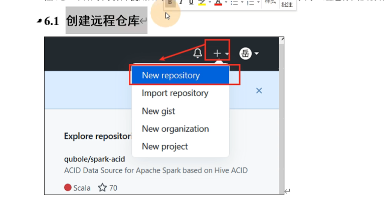

# Git

##  分布式 版本控制工具  vs 集中 式分布

1 版本控制

个人开发过渡到团队合作

集中式 版本控制

cvs  svn

分布式版本控制

Git 

2 代码托管中心  远程库永远是最新的

中央服务器挂掉后，自己可以进行版本控制

没有单点故障

3 git工作机制

4代码托管中心：

  远程库   push  本地库push推送到远程库

局域网 

 gitlab  不开源  搭建自己公司的服务器

互联网

 github 外网

 gitee  国内

## 2 安装 

常用命令

git 通用linux 命令

**1 添加到暂存区**

git add  <file>

将代码从工作区添加到暂存区，相当于追踪文件的过程

// git rm --cacher <file> 删除掉暂存区的文件

**2 提交本地库**

查看版本信息  git reflog   git  log (查看详细的日志命令)

//cat  hellow.txt  打开hellow.txt

<u>***3 修改文件***</u>

****

**4版本穿梭**

// head 指针一直指向master

// master指向版本   底层移动的head 的指针

## 3 开发案例，git常用命令 

#### 分支 特性  分支 创建 分支转换  分支合并  代码合并冲突解决

**1 分支**

*<u>分支的好处</u>* 多个功能开发，提高开发效率

**2 分支的操作**

2.1 查看分支

2.2 创建分支

2.3 修改分支

当前分支

2.4切换分支  git  checkout  <file>

上面一些指针的不懂

2.5 合并分支（正常合并）

2.5.1 代码冲突合并

合并分支时，2个分支，在同一文件中的同一位置有两套完全不同的修改，git无法替我们选择使用哪一个，必须人为决定新代码内容

在master 分支上 修改一个位置 ， 在hot-fix中修改相同位置并上传  下面是master修改结果

下面是hot-fix修改结果

hellow gitl 

222 hot-fix

在master中合并 hot-fix 分支，结果如下

****

**在master中打开 hellow.txt,箭头中间是需要替换的冲突，和两个分支的不同内容。**

**手动合并（修改掉）修改成自己想要的模样**

**修改完毕后，添加到缓存区： 正常提交**

**提交到本地库 ：注意，使用git  commit  命令时 不能带上文件名**

**图解** 

*head -> 分支* 

*分支->具体的版本*

## 代码托管中心， Git 团队合作

**团队内合作**：

**跨团队协作**  2个团队

#### Idea  集成git

# GiHub

## **创建远程库**

## **远程库操作**

### 1 ）创建别名，查看别名 

### 2）推送本地库到远程库

### 3）拉取远程库到本地库  随时让本地库的代码是最新的状态

### 4) 克隆远程库到本地  克隆代码是不需要登录的

​     自动创建的别名 （ origin）

### 5） 邀请加入团队

*注意：同一团队才可以推送 代码。*

### 6)跨团队协作

​    

**代码推送** push

**代码拉取**  pull

**代码克隆**  Clone

SHH **免密登录**

### 7）SSH免密登录

# IDEA 集成 git

##  1.配置Git忽略文件

  为什么要忽略他们？

 与项目的实际项目功能无关，不参与服务器上部署运行，把他们忽略掉能够屏蔽IDE 工具之间的差异。

## 2.定位Git程序

在 IDEA 里定位git

## 3 Git初始化

## 4 添加到本地库

## 5）切换版本

## 6）创建分支

## 7）切换分支

## 8）合并分支

### 8.1正常合并

### 8.2 代码冲突

# IDEA 集成 GitHub

## 1） 设置GitHub账号

## 2）构建git远程库

## 3）上传程序到远程库

空 ：原因 访问github 过慢，可以创建仓库，但无法上传文件，或者上传文件链接时间较长

更新 ：将新写的程序 发送到远程库  

**push注意事项**

## 4）pull 拉取远程库到本地库合并本地库

## 5）clone 克隆远程库到本地

# Gitee

码云创建远程库

Idea 集成gitee

码云连接github进行代码的复制和迁移

## 1） IDEA 安装码云插件

## 2)和github一样

## 3）克隆

## 4）gitee复制github

强制更新gitee中的内容，使gitee和github保持一致

# GitLab 自建代码托管中心

基于局域网的

gitlab 服务器的搭建和部署

Idea集成GitLab

需要服务器

不会    2022年 4月 15号

# 学习git资料

[学习博客]: https://blog.csdn.net/Augenstern_QXL/article/details/120088445

